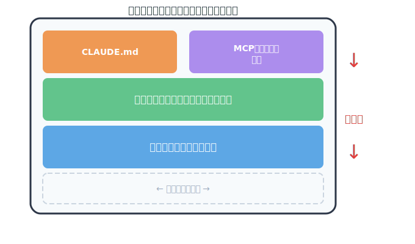

<!-- _class: part -->

# Claude Code
# コンテキストマネジメント入門

Claudeの視界を制御して、最大限の成果を引き出す

---

## 今日のゴール

この資料を読むと分かること：

1. **コンテキストとは何か** — Claudeが見ている世界の正体
2. **なぜマネジメントが必要か** — 放置すると何が起きるか
3. **具体的にどうすればいいか** — 明日から使えるコマンドと運用パターン

すべての情報の出典は **Claude Code 公式ドキュメント**（code.claude.com）のみ

---

<!-- _class: part -->

# Part 1
# コンテキストとは何か

概念を理解する

---

## コンテキストウィンドウ = Claudeの「視界」

- Claudeが**一度に見える**テキストの全体
- この中に入らない情報は **存在しないのと同じ**
- 会話が進むにつれて、この視界は埋まっていく



<span class="source">出典: code.claude.com/docs/en/how-claude-code-works</span>

---

## 何がコンテキストに入るか

<div class="columns">
<div>

### あなたに見えるもの
- 会話履歴（質問と応答）
- 読み込んだファイル内容
- コマンド出力（bash結果）

</div>
<div>

### 裏で読み込まれるもの
- CLAUDE.md（プロジェクト指示）
- MCPサーバーのツール定義
- スキル定義
- システム指示

</div>
</div>

**ポイント**: あなたが明示的に送った情報だけでなく、**裏で自動的に読み込まれるもの**もコンテキストを消費している

<span class="source">出典: code.claude.com/docs/en/how-claude-code-works</span>

---

## コンテキストの確認方法

| コマンド | 表示内容 |
|---------|---------|
| `/context` | コンテキスト使用状況の詳細ビジュアル |
| `/cost` | トークン使用量と実行時間 |
| `/mcp` | MCPサーバーごとのコンテキストコスト |

まずは **`/context`** を一度実行してみるところから

<span class="source">出典: code.claude.com/docs/en/costs</span>

---

<!-- _class: part -->

# Part 2
# なぜマネジメントが必要か

放置すると何が起きるか

---

## コンテキストが溢れると何が起きるか

| 症状 | 体感 |
|------|------|
| 初期の指示が失われる | 「言ったはずなのにやってくれない」 |
| 応答品質の低下 | 関連情報がノイズに埋もれる |
| トークンコストの増加 | 無駄な課金 |
| CLAUDE.md の遵守率低下 | ルールを守らなくなる |

コンテキストの肥大化は **指示忘れ** の最大の原因

<span class="source">出典: code.claude.com/docs/en/best-practices</span>

---

## 自動圧縮 — 便利だが制御不能

コンテキスト上限に近づくと、Claude Code は自動で圧縮する：

1. 古いツール出力を削除
2. 会話を要約
3. ユーザーのリクエストとコードスニペットは保持
4. **初期の詳細な指示は失われる可能性**

> "detailed instructions from early in the conversation may be lost"

**自動圧縮は保険であって戦略ではない** — 何が消えるかを選べない

<span class="source">出典: code.claude.com/docs/en/how-claude-code-works</span>

---

## 公式見解: "Manage context aggressively"

公式ベストプラクティスが **"aggressively"**（積極的に）と明言している

受動的な管理では不十分。では具体的にどうするか？

1. まず **膨らませない**（予防）
2. 次に **膨らんだら対処する**（セッション制御）
3. さらに **コンテキストを分ける**（分離）
4. そして **永続化する**（CLAUDE.md / メモリ）

<span class="source">出典: code.claude.com/docs/en/best-practices</span>

---

<!-- _class: part -->

# Part 3
# そもそも膨らませない

予防が最良の管理

---

## コンテキストを最も汚すパターン

> "Letting Claude jump straight to coding can produce code that solves the wrong problem"

計画なしに実装を始めると：

```
実装 → 失敗 → 修正 → また失敗 → また修正 → ...
```

この**試行錯誤の残骸**がすべてコンテキストに蓄積される

対策: **探索と実装を分ける**

<span class="source">出典: code.claude.com/docs/en/best-practices</span>

---

## Explore first, then plan, then code

公式推奨の4フェーズワークフロー：

| フェーズ | モード | やること |
|---------|--------|---------|
| **1. Explore** | Plan Mode | 調査。読み取り専用、変更なし |
| **2. Plan** | Plan Mode | 実装計画を作成。`Ctrl+G` でエディタ編集 |
| **3. Implement** | Normal Mode | 計画に沿って実装 |
| **4. Commit** | Normal Mode | コミットとPR作成 |

**Plan Mode への切り替え**: `Shift+Tab` で permission mode を順送り
Normal → Auto-Accept → **Plan Mode**（2回押す）

**いつ省略するか**: 1文で差分を説明できるタスク（typo修正、ログ追加など）

<span class="source">出典: code.claude.com/docs/en/best-practices</span>

---

<!-- _class: part -->

# Part 4
# セッション制御

膨らんだ時の対処法

---

## 手段の全体マップ

```
何をしたい？
│
├─ 作業を続けたいが膨らんでいる ──→  /compact
│
├─ 別タスクに切り替えたい ─────────→  /clear
│
├─ 間違った方向に進んだ ──────────→  rewind (Esc+Esc)
│
├─ 中断した作業を再開したい ────→  --continue / --resume
│
└─ ちょっと確認したいだけ ────────→  /btw
```

---

## /compact — コンテキスト圧縮

```bash
/compact                              # デフォルト圧縮
/compact APIの変更に焦点を当てて       # 日本語でも指定可能
```

- 古いツール出力をクリアし、会話を要約
- **焦点指定**で「何を保持するか」をコントロール可能
- CLAUDE.md に永続設定もできる：

```markdown
# Compact Instructions
When you are using compact, please focus on test output and code changes
```

**注意**: 焦点を指定しないと、重要な決定事項が要約で消える可能性あり

<span class="source">出典: code.claude.com/docs/en/best-practices</span>

---

## Summarize from here — 範囲を選んで圧縮

`/compact` は会話**全体**を圧縮するが、一部だけ圧縮したい場合は？

`Esc+Esc`（rewind メニュー）→ チェックポイントを選択 → **「Summarize from here」**

```
  メッセージ1: 設計の議論          ← そのまま残る
  メッセージ2: 方針決定            ← そのまま残る
  ─── ここを選択 ───
  メッセージ3: デバッグ試行錯誤    ← 圧縮される
  メッセージ4: テスト失敗・修正    ← 圧縮される
  メッセージ5: 別のアプローチ試行  ← 圧縮される
```

**ユースケース**: 試行錯誤の部分だけ圧縮して、設計議論はそのまま残したい

<span class="source">出典: code.claude.com/docs/en/checkpointing</span>

---

## /clear — 完全リセット

```bash
/clear
```

- コンテキストウィンドウを**完全にリセット**
- CLAUDE.md は再読み込みされる（永続指示は消えない）
- 公式推奨: **同じ問題で2回以上やり取りして解決しなければ `/clear`**
  - 失敗した修正の履歴がコンテキストを汚し、Claudeの判断を悪化させる
  - `/clear` して、学んだことを反映した**より良いプロンプト**でやり直す方が早い

> A clean session with a better prompt almost always outperforms
> a long session with accumulated corrections.

<span class="source">出典: code.claude.com/docs/en/best-practices</span>

---

## Rewind — セッション内巻き戻し

`Esc + Esc` または `/rewind` でメニューを開く

| オプション | 効果 |
|-----------|------|
| Restore code and conversation | コードと会話の両方を復元 |
| Restore conversation | 会話のみ復元（コードは現状維持） |
| Restore code | コードのみ復元（会話は現状維持） |
| **Summarize from here** | 選択ポイント以降の会話を圧縮 |
| Never mind | キャンセル |

- チェックポイントは**ユーザープロンプトごと + ファイル編集前**に自動作成
- **注意**: Bashコマンド（`rm`, `mv`等）による変更は追跡されない

<span class="source">出典: code.claude.com/docs/en/checkpointing</span>

---

## Resume — セッション再開

```bash
claude --continue          # 最新セッションを再開（-c）
claude --resume            # セッション選択メニュー（-r）
claude --resume "auth-fix" # 名前で指定して再開
```

- `--fork-session` でセッションを分岐（元のセッションは変更なし）
- `/rename "oauth-migration"` でセッションに名前をつける

**Tips**: セッションをgitブランチのように扱う
— 名前をつけておけば後で探しやすい

<span class="source">出典: code.claude.com/docs/en/how-claude-code-works</span>

---

## /btw — 会話履歴に残らないサイド質問

```bash
/btw この関数の引数の型は何？
```

- 回答はオーバーレイ表示、**会話履歴に追加されない**
- メイン会話の履歴を汚さず、長いタスクを脱線させにくい
- **Claudeの作業中でも割り込める**（メインの処理を中断しない）

3つの制約：
1. 現在の会話全体は見える（既知の情報で回答）
2. **ツールは使えない**（ファイル読み込み・コマンド実行は不可）
3. フォローアップ不可（1回の応答で完結）

<span class="source">出典: code.claude.com/docs/en/interactive-mode</span>

---

<!-- _class: part -->

# Part 5
# コンテキストの分離

「管理する」ではなく「分ける」

---

## セッション制御では解決できないケース

ここまでの手段はすべて「1つのコンテキストの中でやりくりする」話だった

しかし、**2つのタスクを同時に進めたい**場合は？

- 機能開発の途中でバグ修正が入った
- `/clear` → 機能開発の進捗が消える
- `/compact` → 2つのタスクのコンテキストが混在する
- `rewind` → 片方の作業を巻き戻すしかない

→ 1つのセッションでは限界がある
→ **セッションごと分ければいい**

---

## Worktree — 並列作業環境

```bash
claude --worktree feature-auth    # 名前指定でworktree作成
claude -w bugfix-123              # 短縮形
```

- 内部的に **git worktree** を使用
- 各 worktree が**独立したディレクトリ・ブランチ・セッション**を持つ
- セッション履歴は独立するが、Auto Memory は共有される

```
ターミナル1:  claude -w feature-auth    # 認証機能を実装中
ターミナル2:  claude -w bugfix-123      # バグ修正を並行
```

<span class="source">出典: code.claude.com/docs/en/common-workflows</span>

---

## Worktree の注意点

- 新しい worktree では `npm install` 等の**環境初期化が必要**
- 自動クリーンアップ:
  - 変更なし → worktree とブランチが自動削除
  - 変更あり → 保持 or 削除を選択
- `.claude/worktrees/` に作成される

<span class="source">出典: code.claude.com/docs/en/common-workflows</span>

---

<!-- _class: part -->

# Part 6
# 永続コンテキスト

セッションを超えて知識を残す

---

## CLAUDE.md — あなたが書く永続指示

- セッションは消えるが、CLAUDE.md は**毎セッション自動で読み込まれる**
- コーディング規約、ワークフロー、ビルドコマンドなどを記述
- **200行以下を目指す** — 超えると遵守率が低下する
- `/init` で自動生成 → そこから削ぎ落とす

配置場所（**具体的なほど優先**）:

| スコープ | 配置場所 |
|---------|----------|
| **プロジェクト** | `./CLAUDE.md` |
| ユーザー | `~/.claude/CLAUDE.md` |

<span class="source">出典: code.claude.com/docs/en/memory</span>

---

## Auto Memory — Claudeが勝手にメモしてくれる

- Claudeが作業中に学んだことを**自動で記録**する仕組み
  - ビルドコマンド、デバッグの洞察、コード風格の好みなど
- 「これ覚えておいて」と言えば明示的に保存もできる
- ユーザーが管理する必要はない
- `/memory` で内容の確認・編集が可能

| | CLAUDE.md | Auto Memory |
|---|-----------|-------------|
| **書き手** | あなた | Claude（自動） |
| **内容** | 指示とルール | 学習とパターン |
| **読み込み** | 毎セッション全文 | MEMORY.md 先頭200行 |

<span class="source">出典: code.claude.com/docs/en/memory</span>

---

<!-- _class: part -->

# Part 7
# まとめ

---

## コンテキスト管理 早見表

| やりたいこと | 手段 | キー / コマンド |
|-------------|------|----------------|
| 使用量を確認 | /context, /cost | — |
| そもそも膨らませない | Plan Mode | `Shift+Tab`（順送り） |
| 圧縮して続行 | /compact | `/compact <焦点>` |
| 完全リセット | /clear | `/clear` |
| 巻き戻し | rewind | `Esc+Esc` |
| 再開 | resume | `claude -c` / `claude -r` |
| 履歴に残さず確認 | /btw | `/btw <質問>` |
| 並列作業 | worktree | `claude -w <名前>` |
| 永続的な指示 | CLAUDE.md | `/init` で生成 |
| 自動学習 | Auto Memory | 自動（管理不要） |

---

## 明日からできること

| Level | アクション |
|-------|-----------|
| **1** | `/context` でコンテキスト使用量を意識する |
| **2** | Plan Mode で「探索 → 計画 → 実装」を分ける |
| **3** | タスク切り替え時に `/clear`、commit したら `/compact` |
| **4** | `/btw` で既知の情報をメイン履歴の外で確認 |
| **5** | CLAUDE.md / Auto Memory で永続コンテキストを設計 |

まずは **Level 1〜3** から。意識するだけで効果が出る

---

## 参考リンク

<div class="small">

| ページ | URL |
|--------|-----|
| How Claude Code works | code.claude.com/docs/en/how-claude-code-works |
| Best Practices | code.claude.com/docs/en/best-practices |
| Checkpointing | code.claude.com/docs/en/checkpointing |
| Interactive mode (/btw) | code.claude.com/docs/en/interactive-mode |
| Sub-agents | code.claude.com/docs/en/sub-agents |
| Memory (CLAUDE.md) | code.claude.com/docs/en/memory |

| Common Workflows | code.claude.com/docs/en/common-workflows |

</div>
